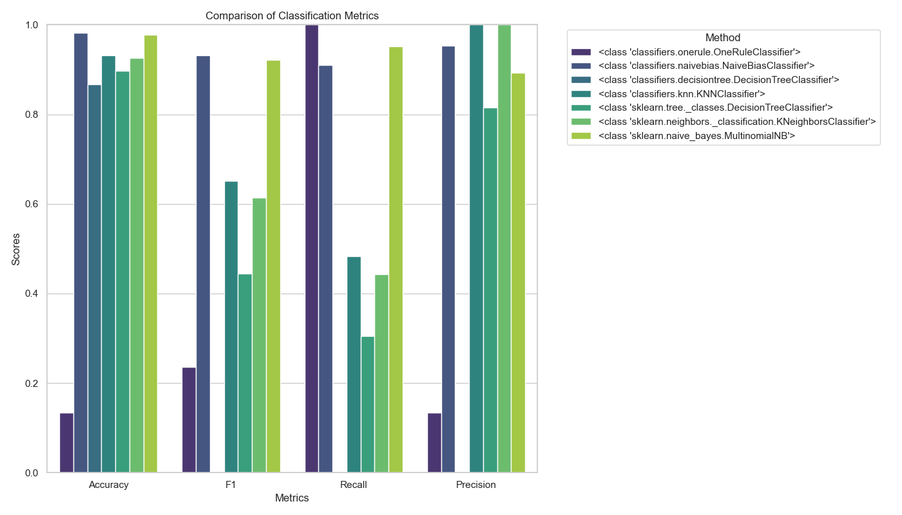

# Comparison of Spam/Ham Classifiers 📧🛡️

## Overview

This repository contains a comparison of different classifiers for the spam/ham problem using a dataset from [Kaggle](https://www.kaggle.com/datasets/bagavathypriya/spam-ham-dataset). The classifiers implemented include Naive Bayes, Decision Tree, and KNN.

## Implementation Details

- **Naive Bayes**:
  - Implementation reference: [Wikipedia](https://en.wikipedia.org/wiki/Naive_Bayes_classifier).
- **Decision Tree**:
  - Implementation reference: YouTube video from [Normilized Nerd](https://www.youtube.com/@NormalizedNerd) ["Decision Tree Classification in Python (from scratch!)"](https://www.youtube.com/watch?v=sgQAhG5Q7iY).
- **KNN**:
  - Implementation reference: [Wikipedia](https://en.wikipedia.org/wiki/K-nearest_neighbors_algorithm).

## Installation

To get started, you need to install the required packages. You can install them using the `requirements.txt` file.

```sh
pip install -r requirements.txt
```

## Usage

1. **Download the Dataset**:
   - Use the provided Jupyter notebook `Classifiers.ipynb` to download the dataset.

2. **Run the Jupyter Notebook**:
   - Open `Classifiers.ipynb` and follow the steps to load the data, split it into training and testing sets, and evaluate the classifiers.

3. **Evaluate Classifiers**:
   - The notebook includes implementation for Naive Bayes, Decision Tree, and KNN classifiers.
   - Results are displayed in a table format, including metrics like Accuracy, F1 Score, Recall, and Precision.

## Example

Here's a snippet from the Jupyter notebook showing how to evaluate the classifiers:

```python
from sklearn.metrics import accuracy_score, f1_score, recall_score, precision_score

table = []
classifiers = [OneRuleClassifier(), NaiveBiasClassifier(), DecisionTreeClassifier(), KNNClassifier()]

for classifier in classifiers:
    classifier.fit(X_train, y_train)
    y_pred = classifier.predict(X_test)
    assert y_pred.shape == y_true.shape

    scores = [score(y_true, y_pred) for score in [accuracy_score, f1_score, recall_score, precision_score]]

    row = [str(type(classifier))] + scores
    table.append(row)

from tabulate import tabulate
tabulate(table, headers=["Method", "Accuracy", "F1", "Recall", "Precision"], tablefmt="html")
```

## Results

For all methods, `sklearn.feature_extraction.text.CountVectorizer` was used.

The evaluation results are displayed in a table format:

| Method                                                |   Accuracy |      F1 |  Recall |  Precision |
|:------------------------------------------------------|------------:|---------:|---------:|------------:|
| <class 'classifiers.onerule.OneRuleClassifier'>       |     0.133768| 0.235971 | 1        |     0.133768|
| <class 'classifiers.naivebias.NaiveBiasClassifier'>   |     0.982055| 0.931393 | 0.910569 |     0.953191|
| <class 'classifiers.decisiontree.DecisionTreeClassifier'> |     0.866232| 0        | 0        |     0        |
| <class 'classifiers.knn.KNNClassifier'>                  |     0.951234| 0.925362 | 0.901234 |     0.949567|

### Comparison with methods from `sklearn`



> For more results' visualization, see [Classifiers.ipynb](Classifiers.ipynb)

## Conclusion

This project provides a comprehensive comparison of different classifiers for the spam/ham problem. The Naive Bayes classifier performed exceptionally well, followed by the KNN, Decision Tree, and One Rule classifiers.

The Decision Tree has the best potential, but its capabilities for this test were limited as the number of features during vectorization slowed training drastically.

The best perfomance, with least CPU time during training and execution had KNN and Naive Bias.

## Contributing

Feel free to contribute by opening issues or pull requests. Your feedback and suggestions are welcome!

## License

This project is licensed under the MIT License.

---

Happy coding! 👨‍💻👩‍💻
